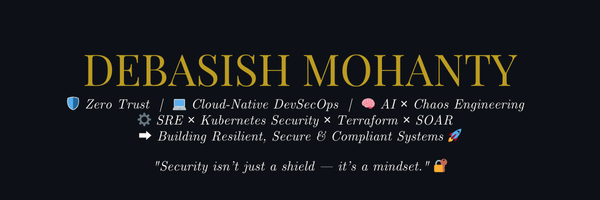

  

<h2 align="center">Hey there 👋, I'm <strong>Debasish Mohanty</strong></h2>
<h4 align="center">🛡️ Cloud DevSecOps Engineer × Full-Stack SRE × Security-First Builder</h4>

  🔥 Zero Trust Advocate • Chaos Engineering Fanatic • AI × Security Enthusiast 
  📍 Bhubaneswar, India • 💬 Pronouns: he/him

---

### 🧠 About Me

- ⚡ Designing **resilient, secure, and compliant** cloud-native architectures
- 🔒 Engineering **threat-aware** CI/CD pipelines, GitOps workflows, and secure infra-as-code
- 🤖 Merging **AI × Security** for smarter detection, response, and automation
- 💡 Open Source Contributor • Chaos Engineer • SOAR Playbook Creator
- 🧩 Passionate about **Zero Trust**, **Resilience Engineering**, and **Privacy by Design**

---

### 🚀 What I'm Working On

- 🧠 GenAI for threat classification and auto-remediation
- ☁️ Self-healing infra using Prometheus + Ansible
- 🔐 Policy-as-Code + GitOps with Kyverno & ArgoCD
- 📊 Observability stacks with Loki, Jaeger, and Grafana

---

### 🧰 Tech Stack

| Domain                         | Tools & Technologies                                                                 |
|:-------------------------------|:-------------------------------------------------------------------------------------|
| 🛡️ DevSecOps & Cloud Security  | Jenkins, Trivy, Gitleaks, Kyverno, OPA, Vault, ArgoCD, kubeaudit                     |
| ☁️ Kubernetes & GitOps         | Kubernetes, Helm, Istio, Terraform, FluxCD, RBAC, Kustomize, Chaos Mesh              |
| 🤖 AI × Security Automation    | Python, TensorFlow, SOAR Playbooks, Threat Intel, Custom LLM Security Scripts        |
| 🔐 Privacy, Compliance & GRC   | Tesseract OCR, AES-256, GDPR/HIPAA Compliance, Data Masking Systems                  |
| 📈 Observability & Response    | Prometheus, Grafana, Loki, EFK, Falco, Falcosidekick, SIEMs (Elastic, Splunk)        |
| 🌐 Web & API Development       | Django, Flask, Node.js, React, PostgreSQL, JavaScript, HTML, CSS                    |

---

### ✨ Featured Projects

       

---

### 📈 GitHub Analytics

  
  

  

---

### 🏆 GitHub Trophies

  

---

### 🌍 Connect with Me

  
  
  
  

---

> 🧠 _“Security isn’t just a shield — it’s a mindset.”_  
> ✨ Let’s build **legendary, secure-by-design systems**, together.

