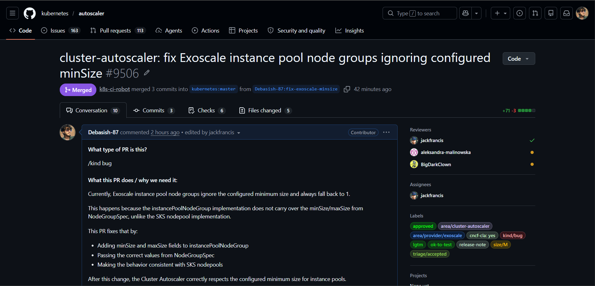
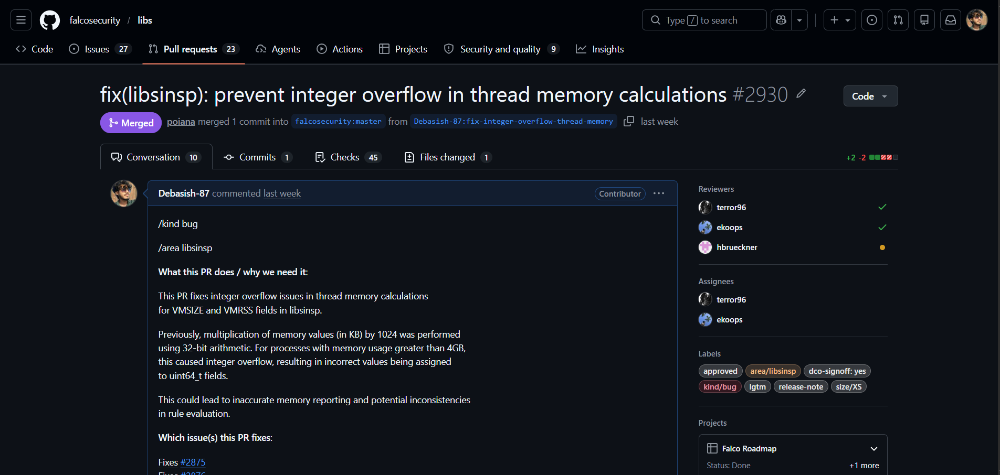
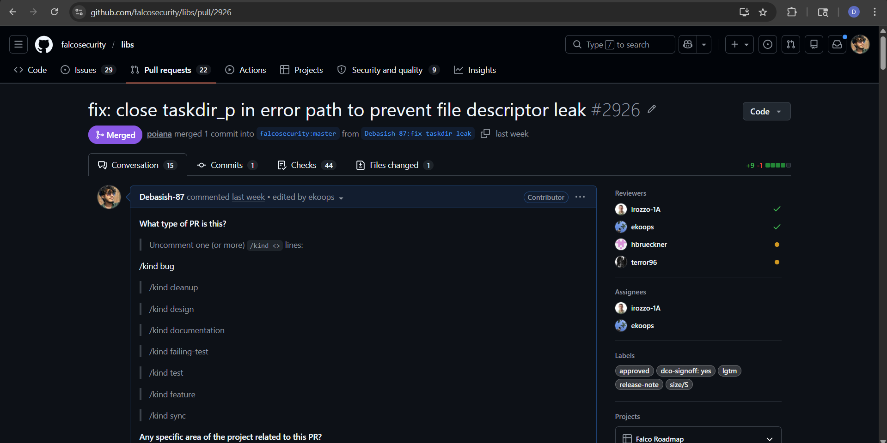

# Open Source Contributions

Merged contributions to production-grade open source projects in the cloud-native ecosystem — fixing real bugs in systems used at scale.

---

## Contributions

| Project | Description | Status |
|---|---|---|
| [kubernetes/autoscaler#9506](https://github.com/kubernetes/autoscaler/pull/9506) | Exoscale instance pool node groups silently ignored the configured `minSize` and always defaulted to `1`, causing the Cluster Autoscaler to under-provision nodes. Added `minSize`/`maxSize` fields to `instancePoolNodeGroup`, wired them through `NodeGroupSpec`, and added a safe fallback with a comment flagging the assumption for future scale-from-zero support. |      |
| [falcosecurity/libs#2930](https://github.com/falcosecurity/libs/pull/2930) | `VMSIZE` and `VMRSS` fields silently overflowed for processes using >4 GB memory due to implicit 32-bit arithmetic in the KB→byte conversion. The result was assigned to `uint64_t`, masking the bug. Fixed by explicitly casting operands to `uint64_t` before multiplication, restoring accurate memory telemetry and preventing incorrect Falco rule evaluation. |       |
| [falcosecurity/libs#2926](https://github.com/falcosecurity/libs/pull/2926) | `taskdir_p` (opened via `opendir()`) was not closed when execution jumped to the error label inside `scap_linux_get_threadlist`, leaking a file descriptor on every failed thread enumeration. Fixed by hoisting the declaration, initializing to `NULL`, and adding explicit cleanup in the error path. Verified with Heaptrack — `0B` leaked under test workloads. |       |
| [helm/helm#31973](https://github.com/helm/helm/pull/31973) | Comments in `registry/client.go` described the wrong behavior for `ClientOptPlainHTTP` and related auth options, misleading contributors about when plain HTTP and credential passing actually occurs. Corrected and clarified all affected comments with no functional changes. |  |

---

## Areas of Focus

- **Systems / Low-level C/C++** — memory safety, integer overflow, resource leak prevention
- **Kubernetes Ecosystem** — cluster autoscaler providers, node group lifecycle
- **Cloud-Native Observability** — Falco `libsinsp` / `libscap` internals
- **Helm / Registry** — client behavior and documentation correctness
