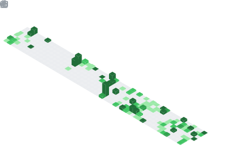

<picture>
  
</picture>

- 👾 AI Platform Engineer, building production AI infra with Python, Kubernetes, AWS & Terraform.
- 🔭 Open Source Contributor to [Kubernetes][kubernetes], [Falco][falco] and [vLLM][vllm].
- 🌱 Currently focused on LLMOps and scalable AI systems.
- 💬 Ask me about Kubernetes, AWS, Terraform, LLMOps and Open Source.
- 📫 Reach out to me on [LinkedIn](https://linkedin.com/in/debasishmohanty87).

For a detailed look at my professional journey, check out my [portfolio](https://www.debasishmohanty.in/).

**Merged in production codebases:**

- [kubernetes/autoscaler#9506][pr1] — fixed Exoscale instance pools ignoring configured `minSize`
- [kubernetes/autoscaler#9515][pr2] — added missing `*/scale` RBAC in VPA Helm chart
- [vllm-project/vllm#48878][pr3] — added `blocks_per_chunk` config for heterogeneous KV cache offloading
- [falcosecurity/libs#2930][pr4] — fixed integer overflow in libsinsp thread memory calc
- [falcosecurity/libs#2926][pr5] — fixed file descriptor leak in scap_linux_get_threadlist

<picture>
  
</picture>

<picture>
  
</picture>

<picture>
  
</picture>

<!-- <picture>
  
</picture> -->

[kubernetes]: //kubernetes.io
[falco]: //falco.org
[vllm]: //vllm.ai
[pr1]: https://github.com/kubernetes/autoscaler/pull/9506
[pr2]: https://github.com/kubernetes/autoscaler/pull/9515
[pr3]: https://github.com/vllm-project/vllm/pull/48878
[pr4]: https://github.com/falcosecurity/libs/pull/2930
[pr5]: https://github.com/falcosecurity/libs/pull/2926
