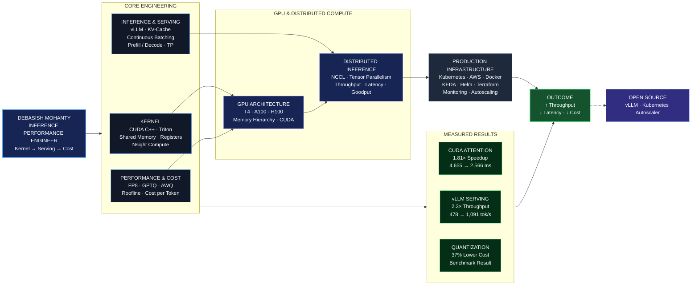

```mermaid
flowchart LR
    A["DEBASISH MOHANTY<br/>INFERENCE PERFORMANCE ENGINEER<br/>Kernel → Serving → Cost"]

    subgraph CORE["CORE ENGINEERING"]
        direction LR
        K["KERNEL<br/>CUDA C++ · Triton<br/>Shared Memory · Registers<br/>Nsight Compute"]
        S["INFERENCE & SERVING<br/>vLLM · KV-Cache<br/>Continuous Batching<br/>Prefill / Decode · TP"]
        C["PERFORMANCE & COST<br/>FP8 · GPTQ · AWQ<br/>Roofline · Cost per Token"]
    end

    subgraph GPU["GPU & DISTRIBUTED COMPUTE"]
        direction TB
        G["GPU ARCHITECTURE<br/>T4 · A100 · H100<br/>Memory Hierarchy · CUDA"]
        D["DISTRIBUTED INFERENCE<br/>NCCL · Tensor Parallelism<br/>Throughput · Latency · Goodput"]
    end

    I["PRODUCTION INFRASTRUCTURE<br/>Kubernetes · AWS · Docker<br/>KEDA · Helm · Terraform<br/>Monitoring · Autoscaling"]

    subgraph RESULTS["MEASURED RESULTS"]
        direction LR
        P1["CUDA ATTENTION<br/>1.81× Speedup<br/>4.655 → 2.566 ms"]
        P2["vLLM SERVING<br/>2.3× Throughput<br/>478 → 1,091 tok/s"]
        P3["QUANTIZATION<br/>37% Lower Cost<br/>Benchmark Result"]
    end

    O["OUTCOME<br/>↑ Throughput<br/>↓ Latency · ↓ Cost"]

    OSS["OPEN SOURCE<br/>vLLM · Kubernetes Autoscaler"]

    A --> CORE
    K --> G
    S --> D
    C --> G
    G --> D
    D --> I
    CORE --> RESULTS
    I --> O
    RESULTS --> O
    O -.-> OSS

    style A fill:#172554,stroke:#60a5fa,color:#fff,stroke-width:2px
    style K fill:#111827,stroke:#60a5fa,color:#fff
    style S fill:#111827,stroke:#60a5fa,color:#fff
    style C fill:#111827,stroke:#60a5fa,color:#fff
    style G fill:#172554,stroke:#818cf8,color:#fff
    style D fill:#172554,stroke:#818cf8,color:#fff
    style I fill:#1e293b,stroke:#94a3b8,color:#fff
    style P1 fill:#052e16,stroke:#4ade80,color:#fff
    style P2 fill:#052e16,stroke:#4ade80,color:#fff
    style P3 fill:#052e16,stroke:#4ade80,color:#fff
    style O fill:#14532d,stroke:#4ade80,color:#fff,stroke-width:2px
    style OSS fill:#312e81,stroke:#a5b4fc,color:#fff
```

**CUDA · C++ · Python · Triton · PyTorch · vLLM · NCCL · Kubernetes · AWS · Terraform**

